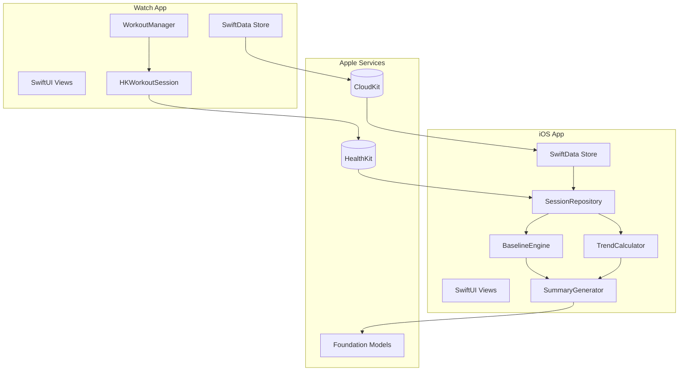

# Heat Lab Technical Implementation Plan

This plan builds the Heat Lab hot yoga tracking app in 8 phases, from project scaffolding through TestFlight release. Each phase produces a working increment.---

## Architecture Overview



---

## Phase 1: Project Setup and Foundation

**Goal:** Xcode project with both targets, capabilities enabled, and SwiftData models defined.

### Tasks

1. **Create Xcode Project** (in Xcode IDE)

- New iOS App with Watch App companion target
- Bundle ID: `com.macpheelabs.heatlab`
- Deployment targets: iOS 18.0, watchOS 11.0
- Enable SwiftUI lifecycle for both targets

2. **Enable Capabilities** (in Xcode IDE)

- HealthKit (both targets) - workout sessions, heart rate, active energy
- CloudKit (both targets) - create container `iCloud.com.macpheelabs.heatlab`
- Background Modes (Watch) - workout processing

3. **Define SwiftData Models**
```swift
// Shared/Models/HeatSession.swift
import SwiftData

@Model
final class HeatSession {
    var id: UUID
    var workoutUUID: UUID?  // Links to HKWorkout
    var startDate: Date
    var endDate: Date?
    var roomTemperature: Int  // Degrees Fahrenheit (e.g., 95, 105)
    var classType: ClassType?
    var userNotes: String?
    var aiSummary: String?
    var createdAt: Date
    
    init(startDate: Date, roomTemperature: Int = 95) {
        self.id = UUID()
        self.startDate = startDate
        self.roomTemperature = roomTemperature
        self.createdAt = Date()
    }
    
    /// Returns a temperature bucket for baseline comparisons
    var temperatureBucket: TemperatureBucket {
        TemperatureBucket.from(temperature: roomTemperature)
    }
}

/// Temperature buckets for baseline grouping (5°F ranges)
enum TemperatureBucket: String, Codable, CaseIterable {
    case warm = "80-89°F"      // 80-89
    case hot = "90-99°F"       // 90-99  
    case veryHot = "100-104°F" // 100-104
    case extreme = "105°F+"    // 105+
    
    static func from(temperature: Int) -> TemperatureBucket {
        switch temperature {
        case ..<90: return .warm
        case 90..<100: return .hot
        case 100..<105: return .veryHot
        default: return .extreme
        }
    }
    
    var displayName: String { rawValue }
}

enum ClassType: String, Codable, CaseIterable {
    case heatedVinyasa = "Heated Vinyasa"
    case power = "Power"
    case sculpt = "Sculpt"
    case hotHour = "Hot Hour"
}
```
```swift
// Shared/Models/UserBaseline.swift
@Model
final class UserBaseline {
    var temperatureBucket: TemperatureBucket  // Grouped by temperature range
    var averageHR: Double
    var sessionCount: Int
    var lastUpdated: Date
    
    init(temperatureBucket: TemperatureBucket, averageHR: Double, sessionCount: Int, lastUpdated: Date) {
        self.temperatureBucket = temperatureBucket
        self.averageHR = averageHR
        self.sessionCount = sessionCount
        self.lastUpdated = lastUpdated
    }
}
```


4. **Configure CloudKit Sync**
```swift
// Shared/HeatLabApp.swift (shared container config)
import SwiftData

let sharedModelContainer: ModelContainer = {
    let schema = Schema([HeatSession.self, UserBaseline.self])
    let config = ModelConfiguration(
        schema: schema,
        cloudKitDatabase: .private("iCloud.com.macpheelabs.heatlab")
    )
    return try! ModelContainer(for: schema, configurations: [config])
}()
```


5. **Set Up XcodeBuildMCP** (in Cursor)

- Add `.cursor/mcp.json` per research plan
- Verify build commands work from terminal

### Deliverable

Project builds for both iOS and Watch simulators. SwiftData models sync via CloudKit.---

## Phase 2: Watch App - Core Workout Tracking

**Goal:** Start, pause, resume, and end workouts with HR capture every 10 seconds.

### Tasks

1. **Create WorkoutManager**
```swift
// WatchApp/Services/WorkoutManager.swift
import HealthKit
import Observation

@Observable
final class WorkoutManager {
    let healthStore = HKHealthStore()
    var session: HKWorkoutSession?
    var builder: HKLiveWorkoutBuilder?
    
    var heartRate: Double = 0
    var activeCalories: Double = 0
    var elapsedTime: TimeInterval = 0
    var isActive: Bool = false
    
    func requestAuthorization() async throws {
        let typesToShare: Set<HKSampleType> = [.workoutType()]
        let typesToRead: Set<HKObjectType> = [
            .workoutType(),
            HKQuantityType(.heartRate),
            HKQuantityType(.activeEnergyBurned)
        ]
        try await healthStore.requestAuthorization(toShare: typesToShare, read: typesToRead)
    }
    
    func startWorkout() async throws {
        let config = HKWorkoutConfiguration()
        config.activityType = .yoga
        config.locationType = .indoor
        
        session = try HKWorkoutSession(healthStore: healthStore, configuration: config)
        builder = session?.associatedWorkoutBuilder()
        builder?.dataSource = HKLiveWorkoutDataSource(healthStore: healthStore, workoutConfiguration: config)
        
        session?.delegate = self
        builder?.delegate = self
        
        let startDate = Date()
        session?.startActivity(with: startDate)
        try await builder?.beginCollection(at: startDate)
        isActive = true
    }
    
    func pause() { session?.pause() }
    func resume() { session?.resume() }
    
    func endWorkout() async throws -> HKWorkout? {
        session?.end()
        try await builder?.endCollection(at: Date())
        let workout = try await builder?.finishWorkout()
        isActive = false
        return workout
    }
}
```


2. **Implement Delegates for HR Updates**
```swift
extension WorkoutManager: HKWorkoutSessionDelegate, HKLiveWorkoutBuilderDelegate {
    func workoutBuilderDidCollectEvent(_ workoutBuilder: HKLiveWorkoutBuilder) {}
    
    func workoutBuilder(_ workoutBuilder: HKLiveWorkoutBuilder, didCollectDataOf types: Set<HKSampleType>) {
        for type in types {
            guard let quantityType = type as? HKQuantityType else { continue }
            let stats = workoutBuilder.statistics(for: quantityType)
            
            Task { @MainActor in
                switch quantityType {
                case HKQuantityType(.heartRate):
                    self.heartRate = stats?.mostRecentQuantity()?.doubleValue(for: .count().unitDivided(by: .minute())) ?? 0
                case HKQuantityType(.activeEnergyBurned):
                    self.activeCalories = stats?.sumQuantity()?.doubleValue(for: .kilocalorie()) ?? 0
                default: break
                }
            }
        }
    }
    
    func workoutSession(_ workoutSession: HKWorkoutSession, didChangeTo toState: HKWorkoutSessionState, from fromState: HKWorkoutSessionState, date: Date) {
        // Handle state changes
    }
    
    func workoutSession(_ workoutSession: HKWorkoutSession, didFailWithError error: Error) {
        // Handle errors
    }
}
```


3. **Build Watch UI - Active Session View**
```swift
// WatchApp/Views/ActiveSessionView.swift
struct ActiveSessionView: View {
    @Environment(WorkoutManager.self) var workoutManager
    
    var body: some View {
        VStack(spacing: 12) {
            Text(workoutManager.elapsedTime.formatted())
                .font(.system(size: 48, weight: .bold, design: .rounded))
            
            HStack {
                Label("\(Int(workoutManager.heartRate))", systemImage: "heart.fill")
                    .foregroundStyle(.red)
                Label("\(Int(workoutManager.activeCalories))", systemImage: "flame.fill")
                    .foregroundStyle(.orange)
            }
            .font(.title3)
            
            HStack {
                Button("Pause") { workoutManager.pause() }
                Button("End") { /* Navigate to confirmation */ }
            }
        }
    }
}
```


### Deliverable

Watch app tracks yoga workouts, displays live HR, and saves completed workouts to HealthKit.---

## Phase 3: Watch App - Session Context Capture

**Goal:** Post-session UI to capture room temperature and class type before finalizing.

### Tasks

1. **Temperature Dial Component**

The Watch's Digital Crown provides a natural "dial" interaction for selecting temperature. Users rotate the crown to adjust the temperature value.

```swift
// WatchApp/Views/TemperatureDialView.swift
struct TemperatureDialView: View {
    @Binding var temperature: Int
    
    // Temperature range for hot yoga: 80°F - 115°F
    private let minTemp = 80
    private let maxTemp = 115
    
    var body: some View {
        VStack(spacing: 8) {
            // Temperature display with color gradient based on heat
            Text("\(temperature)°F")
                .font(.system(size: 44, weight: .bold, design: .rounded))
                .foregroundStyle(temperatureColor)
            
            // Visual arc/gauge indicator
            TemperatureGaugeView(
                temperature: temperature,
                range: minTemp...maxTemp
            )
            .frame(height: 40)
            
            Text("Turn crown to adjust")
                .font(.caption2)
                .foregroundStyle(.secondary)
        }
        .focusable()
        .digitalCrownRotation(
            $temperature,
            from: minTemp,
            through: maxTemp,
            by: 1,
            sensitivity: .medium,
            isContinuous: false,
            isHapticFeedbackEnabled: true
        )
    }
    
    private var temperatureColor: Color {
        switch temperature {
        case ..<90: return .yellow
        case 90..<100: return .orange
        case 100..<105: return .red
        default: return .pink
        }
    }
}

// Visual gauge showing temperature on a curved arc
struct TemperatureGaugeView: View {
    let temperature: Int
    let range: ClosedRange<Int>
    
    var body: some View {
        GeometryReader { geo in
            ZStack {
                // Background arc
                Arc(startAngle: .degrees(135), endAngle: .degrees(405))
                    .stroke(.gray.opacity(0.3), lineWidth: 6)
                
                // Filled arc based on temperature
                Arc(startAngle: .degrees(135), endAngle: .degrees(135 + progress * 270))
                    .stroke(
                        LinearGradient(
                            colors: [.yellow, .orange, .red],
                            startPoint: .leading,
                            endPoint: .trailing
                        ),
                        lineWidth: 6
                    )
            }
        }
    }
    
    private var progress: Double {
        Double(temperature - range.lowerBound) / Double(range.upperBound - range.lowerBound)
    }
}
```


2. **Session Confirmation Flow**
```swift
// WatchApp/Views/SessionConfirmationView.swift
struct SessionConfirmationView: View {
    @Environment(\.modelContext) var modelContext
    @State private var temperature: Int = 95  // Default to common hot yoga temp
    @State private var classType: ClassType?
    let workout: HKWorkout
    let onComplete: () -> Void
    
    var body: some View {
        ScrollView {
            VStack(spacing: 16) {
                Text("Session Complete")
                    .font(.headline)
                
                // Temperature Dial (Digital Crown controlled)
                TemperatureDialView(temperature: $temperature)
                    .frame(height: 120)
                
                Divider()
                
                // Class Type (Optional) - Compact horizontal picker
                Text("Class Type")
                    .font(.caption)
                HStack(spacing: 8) {
                    ForEach(ClassType.allCases, id: \.self) { type in
                        Button(type.shortName) { 
                            classType = classType == type ? nil : type 
                        }
                        .font(.caption2)
                        .buttonStyle(.bordered)
                        .tint(classType == type ? .blue : .gray)
                    }
                }
                
                Button("Save") { saveSession() }
                    .buttonStyle(.borderedProminent)
            }
        }
    }
    
    private func saveSession() {
        let session = HeatSession(startDate: workout.startDate, roomTemperature: temperature)
        session.endDate = workout.endDate
        session.workoutUUID = workout.uuid
        session.classType = classType
        modelContext.insert(session)
        onComplete()
    }
}

// Extension to provide short names for Watch display
extension ClassType {
    var shortName: String {
        switch self {
        case .heatedVinyasa: return "Vinyasa"
        case .power: return "Power"
        case .sculpt: return "Sculpt"
        }
    }
}
```


3. **Navigation Flow**

- Start View -> Active Session -> Confirmation -> Back to Start
- Handle pause/resume without losing context
- Remember last-used temperature as default for next session

### Deliverable

Users can set room temperature via Digital Crown dial and class type on Watch before data syncs.---

## Phase 4: iOS App - Data Layer

**Goal:** Read HealthKit workouts, merge with SwiftData metadata, calculate stats.

### Tasks

1. **SessionRepository - Unified Data Access**
```swift
// iOS/Services/SessionRepository.swift
@Observable
final class SessionRepository {
    private let healthStore = HKHealthStore()
    private let modelContext: ModelContext
    
    func fetchSessionsWithStats() async throws -> [SessionWithStats] {
        // 1. Fetch HeatSession metadata from SwiftData
        let descriptor = FetchDescriptor<HeatSession>(sortBy: [SortDescriptor(\.startDate, order: .reverse)])
        let sessions = try modelContext.fetch(descriptor)
        
        // 2. For each session, fetch corresponding HKWorkout and HR samples
        var results: [SessionWithStats] = []
        for session in sessions {
            guard let workoutUUID = session.workoutUUID else { continue }
            let workout = try await fetchWorkout(uuid: workoutUUID)
            let hrSamples = try await fetchHeartRateSamples(for: workout)
            let stats = computeStats(hrSamples: hrSamples, workout: workout)
            results.append(SessionWithStats(session: session, workout: workout, stats: stats))
        }
        return results
    }
    
    private func computeStats(hrSamples: [HKQuantitySample], workout: HKWorkout?) -> SessionStats {
        let hrValues = hrSamples.map { $0.quantity.doubleValue(for: .count().unitDivided(by: .minute())) }
        return SessionStats(
            averageHR: hrValues.isEmpty ? 0 : hrValues.reduce(0, +) / Double(hrValues.count),
            maxHR: hrValues.max() ?? 0,
            minHR: hrValues.min() ?? 0,
            calories: workout?.totalEnergyBurned?.doubleValue(for: .kilocalorie()) ?? 0,
            duration: workout?.duration ?? 0
        )
    }
}
```


2. **BaselineEngine - Personal Baseline Calculation**

Baselines are grouped by temperature bucket (5°F ranges) rather than exact temperatures. This provides enough sessions per bucket to compute meaningful averages while still capturing the effect of heat.

```swift
// iOS/Services/BaselineEngine.swift
@Observable
final class BaselineEngine {
    private let modelContext: ModelContext
    
    init(modelContext: ModelContext) {
        self.modelContext = modelContext
    }
    
    /// Updates baseline for the temperature bucket this session falls into
    func updateBaseline(for session: HeatSession, averageHR: Double) {
        let bucket = session.temperatureBucket
        let descriptor = FetchDescriptor<UserBaseline>(
            predicate: #Predicate { $0.temperatureBucket == bucket }
        )
        
        if let existing = try? modelContext.fetch(descriptor).first {
            // Rolling average
            let newAvg = (existing.averageHR * Double(existing.sessionCount) + averageHR) / Double(existing.sessionCount + 1)
            existing.averageHR = newAvg
            existing.sessionCount += 1
            existing.lastUpdated = Date()
        } else {
            let baseline = UserBaseline(
                temperatureBucket: bucket,
                averageHR: averageHR,
                sessionCount: 1,
                lastUpdated: Date()
            )
            modelContext.insert(baseline)
        }
    }
    
    /// Compares a session's HR to the user's baseline at that temperature range
    func compareToBaseline(session: SessionWithStats) -> BaselineComparison {
        let bucket = session.session.temperatureBucket
        let descriptor = FetchDescriptor<UserBaseline>(
            predicate: #Predicate { $0.temperatureBucket == bucket }
        )
        guard let baseline = try? modelContext.fetch(descriptor).first,
              baseline.sessionCount >= 3 else {
            return .insufficientData(sessionsNeeded: 3)
        }
        
        let deviation = (session.stats.averageHR - baseline.averageHR) / baseline.averageHR
        switch deviation {
        case ..<(-0.05): return .lowerEffort(percentBelow: abs(deviation * 100))
        case (-0.05)...0.05: return .typical
        default: return .higherEffort(percentAbove: deviation * 100)
        }
    }
    
    /// Gets baseline for a specific temperature bucket
    func baseline(for bucket: TemperatureBucket) -> UserBaseline? {
        let descriptor = FetchDescriptor<UserBaseline>(
            predicate: #Predicate { $0.temperatureBucket == bucket }
        )
        return try? modelContext.fetch(descriptor).first
    }
}

enum BaselineComparison {
    case typical
    case higherEffort(percentAbove: Double)
    case lowerEffort(percentBelow: Double)
    case insufficientData(sessionsNeeded: Int)
    
    var displayText: String {
        switch self {
        case .typical: 
            return "Typical effort for this temperature"
        case .higherEffort(let percent): 
            return "Pushed \(Int(percent))% harder than usual"
        case .lowerEffort(let percent): 
            return "Easier session, \(Int(percent))% below your average"
        case .insufficientData(let needed): 
            return "Need \(needed) more sessions at this temp for baseline"
        }
    }
}
```


### Deliverable

iOS app can fetch sessions with computed stats and compare against personal baselines.---

## Phase 5: iOS App - Session History UI

**Goal:** Display session list and detail views with stats.

### Tasks

1. **History List View**
```swift
// iOS/Views/HistoryView.swift
struct HistoryView: View {
    @Environment(SessionRepository.self) var repo
    @State private var sessions: [SessionWithStats] = []
    
    var body: some View {
        NavigationStack {
            List(sessions, id: \.session.id) { item in
                NavigationLink(value: item) {
                    SessionRowView(session: item)
                }
            }
            .navigationTitle("Sessions")
            .navigationDestination(for: SessionWithStats.self) { item in
                SessionDetailView(session: item)
            }
            .task { sessions = (try? await repo.fetchSessionsWithStats()) ?? [] }
        }
    }
}
```


2. **Session Detail View**
```swift
// iOS/Views/SessionDetailView.swift
struct SessionDetailView: View {
    let session: SessionWithStats
    @Environment(BaselineEngine.self) var baselineEngine
    
    var body: some View {
        ScrollView {
            VStack(alignment: .leading, spacing: 20) {
                // Header with temperature badge
                HStack {
                    Text(session.session.classType?.rawValue ?? "Heated Class")
                        .font(.title2.bold())
                    Spacer()
                    TemperatureBadge(temperature: session.session.roomTemperature)
                }
                
                // Stats Grid
                LazyVGrid(columns: [GridItem(.flexible()), GridItem(.flexible())], spacing: 16) {
                    StatCard(title: "Duration", value: session.stats.duration.formatted())
                    StatCard(title: "Avg HR", value: "\(Int(session.stats.averageHR)) bpm")
                    StatCard(title: "Max HR", value: "\(Int(session.stats.maxHR)) bpm")
                    StatCard(title: "Calories", value: "\(Int(session.stats.calories)) kcal")
                }
                
                // Baseline Comparison
                BaselineComparisonView(comparison: baselineEngine.compareToBaseline(session: session))
                
                // AI Summary (if available)
                if let summary = session.session.aiSummary {
                    Text(summary)
                        .padding()
                        .background(.secondary.opacity(0.1))
                        .clipShape(RoundedRectangle(cornerRadius: 12))
                }
            }
            .padding()
        }
        .navigationTitle(session.session.startDate.formatted(date: .abbreviated, time: .shortened))
    }
}

// Reusable temperature badge component
struct TemperatureBadge: View {
    let temperature: Int
    
    var body: some View {
        Text("\(temperature)°F")
            .font(.subheadline.bold())
            .padding(.horizontal, 12)
            .padding(.vertical, 6)
            .background(backgroundColor.opacity(0.2))
            .foregroundStyle(backgroundColor)
            .clipShape(Capsule())
    }
    
    private var backgroundColor: Color {
        switch temperature {
        case ..<90: return .yellow
        case 90..<100: return .orange
        case 100..<105: return .red
        default: return .pink
        }
    }
}
```


### Deliverable

Users can browse session history and view detailed stats with baseline comparison.---

## Phase 6: iOS App - Trends and Visualization

**Goal:** Show trends over time - intensity vs baseline, recovery, acclimation.

### Tasks

1. **TrendCalculator Service**
```swift
// iOS/Services/TrendCalculator.swift
@Observable
final class TrendCalculator {
    /// Get trend data for a specific temperature bucket
    func calculateIntensityTrend(sessions: [SessionWithStats], bucket: TemperatureBucket) -> [TrendPoint] {
        let filtered = sessions.filter { $0.session.temperatureBucket == bucket }
            .sorted { $0.session.startDate < $1.session.startDate }
        
        return filtered.map { session in
            TrendPoint(
                date: session.session.startDate, 
                value: session.stats.averageHR,
                temperature: session.session.roomTemperature
            )
        }
    }
    
    /// Calculate acclimation signal - is user adapting to this heat level?
    func calculateAcclimation(sessions: [SessionWithStats], bucket: TemperatureBucket) -> AcclimationSignal? {
        let filtered = sessions.filter { $0.session.temperatureBucket == bucket }
            .sorted { $0.session.startDate < $1.session.startDate }
        
        guard filtered.count >= 5 else { return nil }
        
        let firstFive = filtered.prefix(5).map { $0.stats.averageHR }
        let lastFive = filtered.suffix(5).map { $0.stats.averageHR }
        
        let earlyAvg = firstFive.reduce(0, +) / Double(firstFive.count)
        let recentAvg = lastFive.reduce(0, +) / Double(lastFive.count)
        
        let change = (recentAvg - earlyAvg) / earlyAvg
        return AcclimationSignal(
            percentChange: change * 100,
            direction: change < -0.03 ? .improving : .stable,
            sessionCount: filtered.count
        )
    }
}

struct TrendPoint: Identifiable {
    let id = UUID()
    let date: Date
    let value: Double
    let temperature: Int
}

struct AcclimationSignal {
    let percentChange: Double
    let direction: Direction
    let sessionCount: Int
    
    enum Direction { case improving, stable }
    
    var displayText: String {
        switch direction {
        case .improving:
            return "Adapting well! Your avg HR at this heat is \(Int(abs(percentChange)))% lower than when you started."
        case .stable:
            return "Consistent performance at this temperature over \(sessionCount) sessions."
        }
    }
}
```


2. **Trends View with Charts**
```swift
// iOS/Views/TrendsView.swift
import Charts

struct TrendsView: View {
    @Environment(TrendCalculator.self) var calculator
    @Environment(SessionRepository.self) var repo
    @State private var selectedBucket: TemperatureBucket = .veryHot
    @State private var trendData: [TrendPoint] = []
    @State private var acclimation: AcclimationSignal?
    @State private var sessions: [SessionWithStats] = []
    
    var body: some View {
        ScrollView {
            VStack(alignment: .leading, spacing: 24) {
                // Temperature Bucket Picker
                Picker("Temperature Range", selection: $selectedBucket) {
                    ForEach(TemperatureBucket.allCases, id: \.self) { 
                        Text($0.displayName) 
                    }
                }
                .pickerStyle(.segmented)
                
                // Intensity Over Time Chart
                Text("Average HR Over Time")
                    .font(.headline)
                
                if trendData.isEmpty {
                    ContentUnavailableView(
                        "No Sessions Yet",
                        systemImage: "flame",
                        description: Text("Complete sessions at \(selectedBucket.displayName) to see trends")
                    )
                    .frame(height: 200)
                } else {
                    Chart(trendData) { point in
                        LineMark(
                            x: .value("Date", point.date), 
                            y: .value("HR", point.value)
                        )
                        PointMark(
                            x: .value("Date", point.date), 
                            y: .value("HR", point.value)
                        )
                        .annotation(position: .top) {
                            Text("\(point.temperature)°")
                                .font(.caption2)
                                .foregroundStyle(.secondary)
                        }
                    }
                    .chartYAxisLabel("Avg Heart Rate (bpm)")
                    .frame(height: 200)
                }
                
                // Acclimation Signal
                if let acclimation {
                    AcclimationCardView(signal: acclimation)
                }
            }
            .padding()
        }
        .navigationTitle("Trends")
        .task { await loadData() }
        .onChange(of: selectedBucket) { _, _ in updateTrends() }
    }
    
    private func loadData() async {
        sessions = (try? await repo.fetchSessionsWithStats()) ?? []
        updateTrends()
    }
    
    private func updateTrends() {
        trendData = calculator.calculateIntensityTrend(sessions: sessions, bucket: selectedBucket)
        acclimation = calculator.calculateAcclimation(sessions: sessions, bucket: selectedBucket)
    }
}
```


### Deliverable

Users can visualize intensity trends by temperature range and see acclimation signals.---

## Phase 7: Apple Intelligence Summaries

**Goal:** Generate human-readable session summaries using Foundation Models.

### Tasks

1. **SummaryGenerator Service**
```swift
// iOS/Services/SummaryGenerator.swift
import FoundationModels

@Observable
final class SummaryGenerator {
    private let session = LanguageModelSession()
    
    func generateSummary(for sessionWithStats: SessionWithStats, comparison: BaselineComparison) async throws -> String {
        let prompt = buildPrompt(sessionWithStats: sessionWithStats, comparison: comparison)
        
        let response = try await session.respond(to: prompt)
        return response.content
    }
    
    private func buildPrompt(sessionWithStats: SessionWithStats, comparison: BaselineComparison) -> String {
        let stats = sessionWithStats.stats
        let session = sessionWithStats.session
        
        let comparisonText: String
        switch comparison {
        case .typical: comparisonText = "typical effort compared to baseline"
        case .higherEffort: comparisonText = "higher effort than usual"
        case .lowerEffort: comparisonText = "lower effort than usual"
        case .insufficientData: comparisonText = "no baseline comparison available yet"
        }
        
        return """
        Generate a brief, friendly 2-3 sentence summary of this heated yoga session.
        
        Class: \(session.classType?.rawValue ?? "Heated Class")
        Room Temperature: \(session.roomTemperature)°F
        Duration: \(Int(stats.duration / 60)) minutes
        Average Heart Rate: \(Int(stats.averageHR)) bpm
        Max Heart Rate: \(Int(stats.maxHR)) bpm
        Calories: \(Int(stats.calories))
        Baseline Comparison: \(comparisonText)
        
        Focus on how this session compares to their usual at similar temperatures. Be encouraging but not over-the-top.
        """
    }
}
```


2. **Integrate into Session Detail**

- Generate summary after session sync completes
- Cache summary in `HeatSession.aiSummary`
- Show loading state while generating

### Deliverable

Sessions display AI-generated summaries contextualizing stats against personal baseline.---

## Phase 8: Polish, Testing, and Release

**Goal:** Refine UI, test on physical devices, beta release.

### Tasks

1. **UI Polish**

- Watch app: Always On display support, haptic feedback on milestones
- iOS app: App icon, launch screen, onboarding for HealthKit permissions
- Consistent typography and color scheme (warm, studio-inspired palette)

2. **HealthKit Permission Flow**
```swift
// Shared/Services/HealthKitAuthorization.swift
struct HealthKitAuthorizationView: View {
    @State private var isAuthorized = false
    let onComplete: () -> Void
    
    var body: some View {
        VStack(spacing: 20) {
            Image(systemName: "heart.text.square")
                .font(.system(size: 60))
                .foregroundStyle(.red)
            
            Text("Heat Lab needs access to your health data to track workouts and heart rate.")
                .multilineTextAlignment(.center)
            
            Button("Enable HealthKit") {
                Task {
                    try? await WorkoutManager().requestAuthorization()
                    isAuthorized = true
                    onComplete()
                }
            }
            .buttonStyle(.borderedProminent)
        }
        .padding()
    }
}
```


3. **Testing Checklist**

- Unit tests for `BaselineEngine` calculations
- Unit tests for `TrendCalculator` edge cases
- UI tests for Watch session flow
- Physical Watch testing in actual hot environment
- CloudKit sync verification across devices

4. **TestFlight Release**

- Archive iOS + Watch app in Xcode
- Upload to App Store Connect
- Add beta testers (studio members)
- Collect feedback via TestFlight forms

### Deliverable

App ready for TestFlight beta with core functionality complete.---

## File Structure

```javascript
HeatLab/
├── Shared/
│   ├── Models/
│   │   ├── HeatSession.swift
│   │   ├── UserBaseline.swift
│   │   └── SessionStats.swift
│   └── HeatLabApp.swift (container config)
├── iOS/
│   ├── Services/
│   │   ├── SessionRepository.swift
│   │   ├── BaselineEngine.swift
│   │   ├── TrendCalculator.swift
│   │   └── SummaryGenerator.swift
│   └── Views/
│       ├── HistoryView.swift
│       ├── SessionDetailView.swift
│       ├── TrendsView.swift
│       └── Components/
├── WatchApp/
│   ├── Services/
│   │   └── WorkoutManager.swift
│   └── Views/
│       ├── StartView.swift
│       ├── ActiveSessionView.swift
│       └── SessionConfirmationView.swift
└── Tests/
    ├── BaselineEngineTests.swift
    └── TrendCalculatorTests.swift
```

---

## Timeline Estimate

| Phase | Duration | Dependencies ||-------|----------|--------------|| Phase 1: Setup | 2-3 days | Xcode IDE required || Phase 2: Watch Workout | 3-4 days | Phase 1 || Phase 3: Watch Context | 2 days | Phase 2 || Phase 4: iOS Data Layer | 3-4 days | Phase 1 || Phase 5: iOS History UI | 3 days | Phase 4 || Phase 6: Trends | 3-4 days | Phase 5 || Phase 7: AI Summaries | 2-3 days | Phase 5 || Phase 8: Polish + Beta | 4-5 days | All phases |**Total: 4-5 weeks** for a solo developer with Swift experience.---