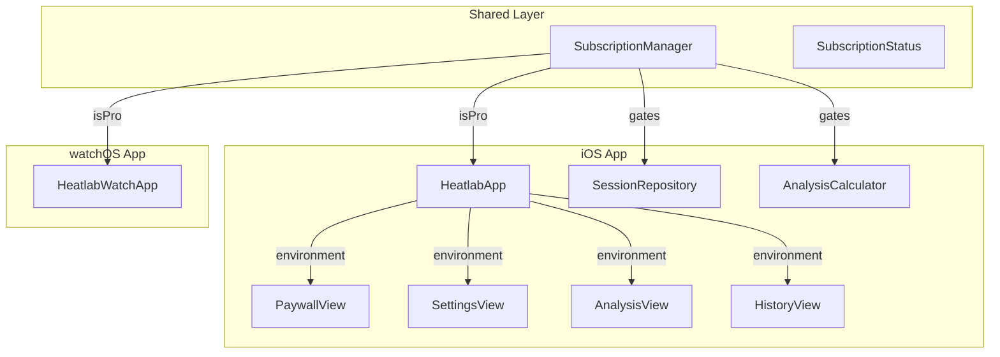

# Heatlab Monetization Implementation

## Architecture Overview



## Key Files to Create

| File | Purpose |

|------|---------|

| `Shared/Services/SubscriptionManager.swift` | StoreKit 2 service with entitlement checking |

| `Shared/Models/SubscriptionStatus.swift` | Enum for subscription state |

| `Heatlab/Views/PaywallView.swift` | Subscription purchase UI |

| `Heatlab/Views/Components/ProGate.swift` | View modifier for gating Pro features |

| `Heatlab/Heatlab.storekit` | StoreKit configuration for Simulator testing |

| `Heatlab/PrivacyInfo.xcprivacy` | Privacy manifest for App Store compliance |

## Key Files to Modify

| File | Changes |

|------|---------|

| [`Heatlab/HeatlabApp.swift`](Heatlab/HeatlabApp.swift) | Inject SubscriptionManager as environment |

| [`Heatlab/Views/SettingsView.swift`](Heatlab/Views/SettingsView.swift) | Add Subscription section |

| [`Heatlab/Services/SessionRepository.swift`](Heatlab/Services/SessionRepository.swift) | Add 7-day filter for free users |

| [`Heatlab/Services/AnalysisCalculator.swift`](Heatlab/Services/AnalysisCalculator.swift) | Gate period comparisons |

| [`Heatlab/Views/AnalysisView.swift`](Heatlab/Views/AnalysisView.swift) | Gate AI insights, add upgrade prompts |

| [`Heatlab/Views/HistoryView.swift`](Heatlab/Views/HistoryView.swift) | Show upgrade prompt for older sessions |

| [`HeatlabWatch/HeatlabWatchApp.swift`](HeatlabWatch/HeatlabWatchApp.swift) | Add SubscriptionManager for entitlement sync |

---

## 1. SubscriptionManager Service

Create `Shared/Services/SubscriptionManager.swift`:

```swift
@Observable
final class SubscriptionManager {
    private(set) var isPro: Bool = false
    private(set) var products: [Product] = []
    private(set) var purchaseState: PurchaseState = .ready
    
    private let productIDs = [
        "com.heatlab.pro.monthly",
        "com.heatlab.pro.annual"
    ]
    
    // Load products, check entitlements, listen for updates
    func start() async { ... }
    func purchase(_ product: Product) async throws { ... }
    func restorePurchases() async { ... }
}
```

Key implementation details:

- Use `Product.products(for:)` to load subscription products
- Check `Transaction.currentEntitlements` for active subscriptions
- Listen to `Transaction.updates` for real-time status changes
- Call `AppStore.sync()` for restore purchases

---

## 2. PaywallView UI

Create `Heatlab/Views/PaywallView.swift` with:

- Two subscription cards (Monthly $4.99, Annual $39.99 with savings badge)
- Required disclosures: auto-renewal, cancellation instructions
- Restore Purchases button
- Links to Terms of Use and Privacy Policy
- Loading/error states

Design pattern:

```swift
struct PaywallView: View {
    @Environment(SubscriptionManager.self) var subscriptionManager
    @Environment(\.dismiss) var dismiss
    
    var body: some View {
        // Header with feature comparison
        // Subscription cards
        // Restore + Terms/Privacy links
    }
}
```

---

## 3. ProGate View Modifier

Create `Heatlab/Views/Components/ProGate.swift`:

```swift
struct ProGate<Content: View>: View {
    @Environment(SubscriptionManager.self) var subscriptionManager
    let feature: String
    @ViewBuilder let content: () -> Content
    @State private var showingPaywall = false
    
    var body: some View {
        if subscriptionManager.isPro {
            content()
        } else {
            // Teaser with upgrade prompt
            UpgradePromptView(feature: feature)
                .onTapGesture { showingPaywall = true }
                .sheet(isPresented: $showingPaywall) { PaywallView() }
        }
    }
}
```

---

## 4. Free Tier Enforcement

### SessionRepository

Add `isPro` parameter to fetch methods in [`SessionRepository.swift`](Heatlab/Services/SessionRepository.swift):

```swift
func fetchSessionsWithStats(isPro: Bool = false) async throws -> [SessionWithStats] {
    // Existing fetch logic...
    
    if !isPro {
        let sevenDaysAgo = Calendar.current.date(byAdding: .day, value: -7, to: Date())!
        return results.filter { $0.session.startDate >= sevenDaysAgo }
    }
    return results
}
```

### AnalysisCalculator

Gate period comparisons in [`AnalysisCalculator.swift`](Heatlab/Services/AnalysisCalculator.swift):

```swift
func analyze(sessions: [SessionWithStats], filters: AnalysisFilters, isPro: Bool) -> AnalysisResult {
    // For free users, only allow .week period
    let effectivePeriod = isPro ? filters.period : .week
    // ...
}
```

### AnalysisView

Gate AI insights and month/year periods in [`AnalysisView.swift`](Heatlab/Views/AnalysisView.swift):

```swift
// Period picker with Pro badge on Month/Year
Picker("Period", selection: $selectedPeriod) {
    Text("Week").tag(AnalysisPeriod.week)
    HStack {
        Text("Month")
        if !subscriptionManager.isPro { Image(systemName: "lock.fill") }
    }.tag(AnalysisPeriod.month)
    // ...
}

// AI Insight section
if subscriptionManager.isPro {
    AIInsightSection(state: state) { ... }
} else {
    ProGate(feature: "AI Insights") { AIInsightSection(...) }
}
```

---

## 5. Settings Subscription Section

Add to [`SettingsView.swift`](Heatlab/Views/SettingsView.swift):

```swift
Section {
    if subscriptionManager.isPro {
        HStack {
            Label("Heatlab Pro", systemImage: "checkmark.seal.fill")
            Spacer()
            Text("Active").foregroundStyle(.secondary)
        }
        Button("Manage Subscription") {
            // Open App Store subscription management
        }
    } else {
        Button("Upgrade to Pro") { showingPaywall = true }
    }
    Button("Restore Purchases") {
        Task { await subscriptionManager.restorePurchases() }
    }
} header: {
    Text("Subscription")
}
```

---

## 6. watchOS Subscription Sync

Update [`HeatlabWatchApp.swift`](HeatlabWatch/HeatlabWatchApp.swift):

```swift
@State private var subscriptionManager = SubscriptionManager()

var body: some Scene {
    WindowGroup {
        ContentView()
            .environment(subscriptionManager)
            .task { await subscriptionManager.start() }
    }
}
```

watchOS uses the same StoreKit 2 APIs - entitlements are tied to Apple ID, so the same subscription works on both devices automatically.

---

## 7. StoreKit Configuration File

Create `Heatlab/Heatlab.storekit` with:

- Product: `com.heatlab.pro.monthly` - $4.99/month auto-renewable
- Product: `com.heatlab.pro.annual` - $39.99/year auto-renewable
- Subscription Group: "Heatlab Pro"

This enables Simulator testing without App Store Connect.

---

## 8. Privacy Manifest

Create `Heatlab/PrivacyInfo.xcprivacy`:

```xml
<dict>
    <key>NSPrivacyAccessedAPITypes</key>
    <array>
        <dict>
            <key>NSPrivacyAccessedAPIType</key>
            <string>NSPrivacyAccessedAPICategoryUserDefaults</string>
            <key>NSPrivacyAccessedAPITypeReasons</key>
            <array>
                <string>CA92.1</string>
            </array>
        </dict>
    </array>
</dict>
```

---

## Upgrade Prompt Locations

| Location | Trigger | Prompt Style |

|----------|---------|--------------|

| History (older sessions) | Scroll past 7-day cutoff | Inline banner |

| Analysis (Month/Year) | Tap locked period | Sheet paywall |

| Analysis (AI Insights) | View insight section | Inline teaser card |

| Trends (full history) | View trends beyond 7 days | Inline banner |

---

## Testing Checklist

- [ ] Fresh install shows free tier limits
- [ ] Purchase flow completes successfully (StoreKit testing)
- [ ] Pro features unlock immediately after purchase
- [ ] Restore purchases works on fresh install
- [ ] Subscription persists across app launches
- [ ] watchOS reflects same Pro status as iOS
- [ ] Upgrade prompts appear at all gate points