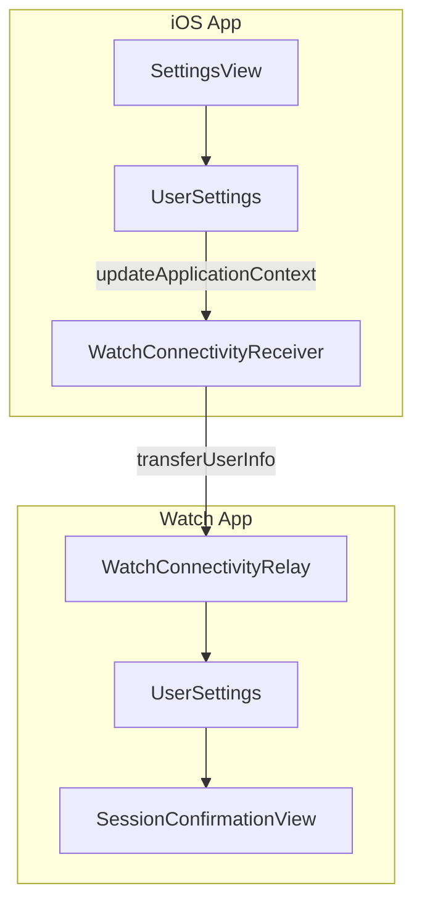

# Settings Sync Implementation Plan

## Architecture Overview



## 1. Create SessionTypeConfig Model

**File:** [Shared/SessionTypeConfig.swift](Shared/SessionTypeConfig.swift) (new file)

```swift
struct SessionTypeConfig: Codable, Identifiable, Equatable {
    let id: UUID
    let name: String
    let isDefault: Bool      // true for built-in types
    var isVisible: Bool      // whether to show on Watch picker
    var isDeleted: Bool      // soft delete - only meaningful for custom types
    
    // Default types cannot be deleted
    var canDelete: Bool { !isDefault }
    
    // MARK: - Canonical UUIDs for Default Types
    // These are constant across all installations for future server-side analytics
    enum DefaultTypeID {
        static let heatedVinyasa = UUID(uuidString: "A1B2C3D4-1111-1111-1111-000000000001")!
        static let power         = UUID(uuidString: "A1B2C3D4-1111-1111-1111-000000000002")!
        static let sculpt        = UUID(uuidString: "A1B2C3D4-1111-1111-1111-000000000003")!
        static let hotHour       = UUID(uuidString: "A1B2C3D4-1111-1111-1111-000000000004")!
    }
    
    static let defaults: [SessionTypeConfig] = [
        SessionTypeConfig(id: DefaultTypeID.heatedVinyasa, name: "Heated Vinyasa", isDefault: true, isVisible: true, isDeleted: false),
        SessionTypeConfig(id: DefaultTypeID.power, name: "Power", isDefault: true, isVisible: true, isDeleted: false),
        SessionTypeConfig(id: DefaultTypeID.sculpt, name: "Sculpt", isDefault: true, isVisible: true, isDeleted: false),
        SessionTypeConfig(id: DefaultTypeID.hotHour, name: "Hot Hour", isDefault: true, isVisible: true, isDeleted: false),
    ]
}
```

**Behavior Matrix:**

| Type | Toggle Visibility | Delete |

|------|------------------|--------|

| Default | Yes | No (button hidden) |

| Custom (active) | Yes | Soft delete |

| Custom (deleted) | N/A (hidden from UI) | N/A |

## 2. Extend UserSettings (Shared)

**File:** [Shared/UserSettings.swift](Shared/UserSettings.swift)

Add new settings with UserDefaults persistence:

```swift
var showCaloriesInApp: Bool    // default: true - controls iOS dashboard, detail, row views
var showCaloriesOnWatch: Bool  // default: false - controls Watch active session & confirmation

var sessionTypeConfigs: [SessionTypeConfig]  // stored as JSON, initialized with defaults
```

Add helper methods:

- `visibleSessionTypes: [SessionTypeConfig]` - non-deleted AND visible types (for Watch picker)
- `manageableSessionTypes: [SessionTypeConfig]` - non-deleted types (for iOS settings UI)
- `addCustomType(name: String)` - creates new custom type
- `softDeleteCustomType(id: UUID)` - marks custom type as deleted (no-op for defaults)
- `setVisibility(id: UUID, visible: Bool)` - toggles visibility
- `toDictionary() -> [String: Any]` - serialize for WatchConnectivity
- `apply(from dict: [String: Any])` - deserialize incoming settings

## 3. Update HeatSession Model

**File:** [Shared/Models/HeatSession.swift](Shared/Models/HeatSession.swift)

Replace `classType: ClassType?` with `sessionTypeId: UUID?` and **remove the `ClassType` enum entirely** (no migration needed in early dev):

```swift
// Remove entirely
enum ClassType: String, Codable, CaseIterable { ... }

// Remove
var classType: ClassType?

// Add
var sessionTypeId: UUID?  // References SessionTypeConfig.id
```

**Display helper** (add to UserSettings):

```swift
func sessionTypeName(for id: UUID?) -> String? {
    guard let id else { return nil }
    return sessionTypeConfigs.first { $0.id == id }?.name
}
```

## 4. iOS Settings UI

**File:** [Heatlab/Views/SettingsView.swift](Heatlab/Views/SettingsView.swift)

Add two new sections:

**Display Preferences Section:**

- Toggle: "Show Calories in App" (default: on)
- Toggle: "Show Calories on Watch" (default: off)
- Footer: "Some practitioners prefer to focus on the meditative aspects of their practice rather than exercise metrics."

**Session Types Section:**

- List of `settings.manageableSessionTypes`
- Each row shows: name, visibility toggle, delete button (only for custom)
- "Add Custom Type" button at bottom with alert/sheet for name input
- Footer: "Toggle visibility to show/hide types on Apple Watch. Default types cannot be removed."

## 5. Conditionally Display Calories (iOS)

Update views to check `settings.showCaloriesInApp`:

- [Heatlab/Views/DashboardView.swift](Heatlab/Views/DashboardView.swift) - Hide "Calories Burned" stat card
- [Heatlab/Views/SessionDetailView.swift](Heatlab/Views/SessionDetailView.swift) - Hide calories in stats grid
- [Heatlab/Views/SessionRowView.swift](Heatlab/Views/SessionRowView.swift) - Hide calories label in quick stats

## 6. Settings Sync: iOS to Watch

**File:** [Heatlab/Services/WatchConnectivityReceiver.swift](Heatlab/Services/WatchConnectivityReceiver.swift)

Add method to push settings to Watch:

- Use `WCSession.default.updateApplicationContext(_:)` - delivers latest settings even if app not running
- Call this when settings change and on app launch

## 7. Settings Sync: Watch Receives

**File:** [HeatlabWatch/Services/WatchConnectivityRelay.swift](HeatlabWatch/Services/WatchConnectivityRelay.swift)

- Implement `session(_:didReceiveApplicationContext:)` delegate method
- Parse incoming settings dictionary and apply to local `UserSettings`
- Request settings on activation if context is empty

## 8. Watch UI Updates

**File:** [HeatlabWatch/Views/SessionConfirmationView.swift](HeatlabWatch/Views/SessionConfirmationView.swift)

- Replace `ClassType.allCases` loop with `settings.visibleSessionTypes`
- Store selected type **UUID** in session (not string)
- Optionally show calories in post-session summary based on `settings.showCaloriesOnWatch`
```swift
// State
@State private var selectedTypeId: UUID?

// Before
ForEach(ClassType.allCases, id: \.self) { type in ... }

// After  
ForEach(settings.visibleSessionTypes) { typeConfig in
    ClassTypeButton(
        name: typeConfig.name,
        isSelected: selectedTypeId == typeConfig.id,
        action: { selectedTypeId = typeConfig.id }
    )
}

// When saving
session.sessionTypeId = selectedTypeId
```


## 9. Watch Active Session

**File:** [HeatlabWatch/Views/ActiveSessionView.swift](HeatlabWatch/Views/ActiveSessionView.swift)

Optionally show live calories during workout if `settings.showCaloriesOnWatch` is true (currently only shows HR).

## Key Implementation Notes

- **Application Context** is the right WatchConnectivity mechanism for settings - it's persistent and delivers the latest state even if the counterpart app wasn't running
- Settings should sync immediately when changed and also on app launch
- **Soft-deleted types** remain in storage forever (referenced by historical sessions via UUID) but are hidden from all UI
- **Default types** use hardcoded canonical UUIDs - consistent across all app installations for future server-side anonymous analytics
- **Custom types** get random UUIDs when created
- **No migration needed** - early development phase, `ClassType` enum removed entirely