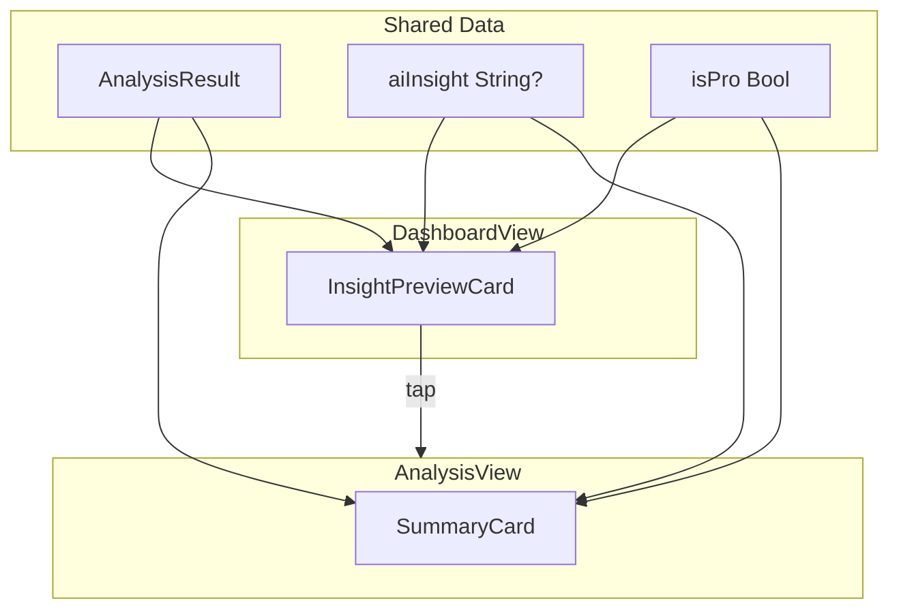

# Summary Card Redesign

## Overview

Create a unified Summary card in AnalysisView following the Weather app pattern. DashboardView remains mostly the same but shows AI teaser for Pro users.

---

## Scope

**AnalysisView (main changes):**

- Combined SummaryCard with factual text, AI insights, and metrics
- AI sparkle icon when content is AI-generated
- "AI insights" upsell for free users within the same card

**DashboardView (minor enhancement):**

- Pro users: Show first sentence of AI insight + "..." as teaser to navigate to Analysis
- Free users: Keep current InsightPreviewCard behavior (factual summary)

---

## Current AnalysisView Structure

```
InsightHookView (factual 1-2 lines + comparison delta)
   ↓
AIInsightSection / UpgradePromptCard (separate card)
   ↓
MetricsStripView (horizontal metrics)
```

---

## New AnalysisView Structure: Unified SummaryCard

```
SummaryCard
├── Top: Text Section
│   ├── Free: Factual summary + upsell teaser
│   └── Pro: AI interpretation with sparkle icon (or factual while loading)
├── Divider (horizontal line)
└── Bottom: Metrics Row (Sessions, Temp, Avg HR, HR Range)
```

---

## 1. Create SummaryCard Component

Create [`Heatlab/Views/Components/SummaryCard.swift`](Heatlab/Views/Components/SummaryCard.swift):

```swift
struct SummaryCard: View {
    let result: AnalysisResult
    let isPro: Bool
    let aiInsight: String?
    let isGeneratingInsight: Bool
    let onUpgradeTap: () -> Void
    
    var body: some View {
        VStack(alignment: .leading, spacing: 0) {
            // Text Section
            textSection
                .padding()
            
            Divider()
                .padding(.horizontal)
            
            // Metrics Row (always visible)
            MetricsStripView(
                comparison: result.comparison,
                trendPoints: result.trendPoints,
                period: result.filters.period
            )
            .padding()
        }
        .background(Color(.systemGray6))
        .clipShape(RoundedRectangle(cornerRadius: HeatLabRadius.lg))
    }
    
    @ViewBuilder
    private var textSection: some View {
        if isPro {
            proTextSection
        } else {
            freeTextSection
        }
    }
}
```

**Pro text section:**

- When AI insight available: Show insight with sparkle icon header
- When generating: Show factual text + loading indicator
- AI unavailable: Show factual text only

**Free text section:**

- Factual summary (strictly factual, no W-over-W comparison)
- Below: Upsell teaser row ("Unlock AI insights" + lock icon)

**AI Sparkle indicator:**

- Header row: Sparkle icon + "Insight" label when showing AI content
- Distinguishes AI-generated text from factual summary

---

## 2. Update AnalysisView

In [`Heatlab/Views/AnalysisView.swift`](Heatlab/Views/AnalysisView.swift):

**Remove:**

- `InsightHookView(result: result)`
- `insightSection` (AIInsightSection / UpgradePromptCard)
- `MetricsStripView(...)`
- `noPriorPeriodHint` view

**Add:**

- Single `SummaryCard(...)` in place of the above

**New section order:**

1. Period picker
2. Filter pills
3. **SummaryCard** (new unified component)
4. Trend chart
5. Acclimation card (when available)

---

## 3. Update InsightPreviewCard (DashboardView)

In [`Heatlab/Views/Components/InsightPreviewCard.swift`](Heatlab/Views/Components/InsightPreviewCard.swift):

Add `aiInsight: String?` and `isPro: Bool` parameters.

**Pro behavior:**

- If AI insight available: Show first sentence + "..." + sparkle icon
- If AI generating/unavailable: Show factual summary (current behavior)

**Free behavior:**

- Keep current factual summary
- "Tap for details" subtitle

---

## 4. Move ComparisonStatItem and DeltaIndicator

Currently defined in [`Heatlab/Views/Components/ComparisonCard.swift`](Heatlab/Views/Components/ComparisonCard.swift).

Move to [`Heatlab/Views/DashboardView.swift`](Heatlab/Views/DashboardView.swift) since DashboardView is the only remaining consumer.

---

## 5. Delete ComparisonCard.swift

Remove [`Heatlab/Views/Components/ComparisonCard.swift`](Heatlab/Views/Components/ComparisonCard.swift) after moving shared components.

---

## 6. Delete InsightHookView and AIInsightSection

- [`Heatlab/Views/Components/InsightHookView.swift`](Heatlab/Views/Components/InsightHookView.swift) - logic moves to SummaryCard
- [`Heatlab/Views/Components/AIInsightSection.swift`](Heatlab/Views/Components/AIInsightSection.swift) - logic moves to SummaryCard

---

## Data Flow



---

## Files Changed

- **Create:** `Heatlab/Views/Components/SummaryCard.swift`
- **Modify:** `Heatlab/Views/AnalysisView.swift` - use SummaryCard
- **Modify:** `Heatlab/Views/Components/InsightPreviewCard.swift` - add AI teaser for Pro
- **Modify:** `Heatlab/Views/DashboardView.swift` - pass AI insight to InsightPreviewCard, move ComparisonStatItem/DeltaIndicator here
- **Delete:** `Heatlab/Views/Components/ComparisonCard.swift`
- **Delete:** `Heatlab/Views/Components/InsightHookView.swift`
- **Delete:** `Heatlab/Views/Components/AIInsightSection.swift`

---

## UX Details

- **AI Sparkle:** Show sparkle icon in header when displaying AI-generated content
- **Divider style:** Thin horizontal line matching Weather app pattern
- **Upsell teaser:** Small, subtle row within the card (not a separate card)
- **AI loading state:** Show factual text + small spinner, metrics always visible
- **Tap target:** Entire upsell row tappable to trigger paywall