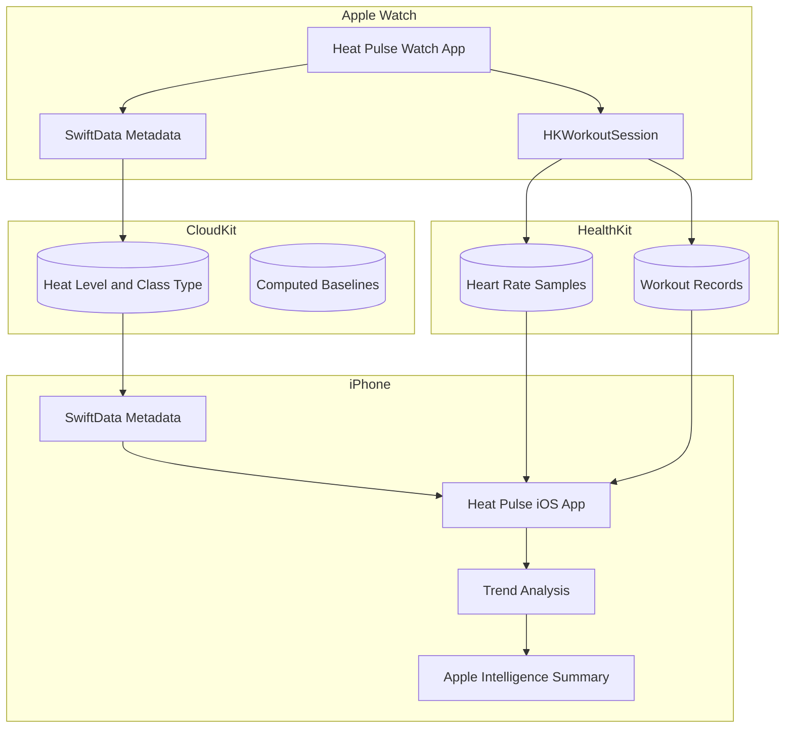
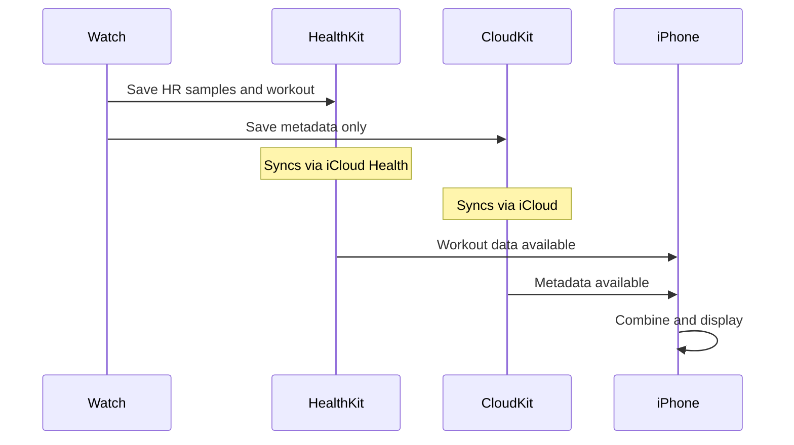
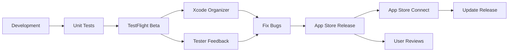

# Heat Pulse Technical Research Plan

Technical research plan for Heat Pulse - a hot yoga tracking app with Apple Watch companion, using HealthKit for biometric data, CloudKit for app metadata sync, and Apple Intelligence for AI summaries.

---

## Confirmed Decisions

| Decision | Choice |
|----------|--------|
| Architecture | Companion App (Watch + iOS bundled) |
| Minimum OS | iOS 18+ / watchOS 11+ (latest, no fallbacks) |
| HR Sample Rate | Every 10 seconds |
| HealthKit | Read AND write workouts back |
| Offline-first | Yes, Watch works without iPhone |
| AI Summaries | Apple Intelligence Foundation Models |
| Analytics | None for v1 |
| Bug Monitoring | Apple built-in (Xcode Organizer, App Store Connect) |
| Dev Tooling | Cursor + XcodeBuildMCP + Xcode CLI |

---

## 1. Development Ecosystem Overview

### Language and Tools

- **Swift**: Apple's modern programming language for all Apple platforms. Strongly-typed, safe, and beginner-friendly compared to Objective-C.
- **SwiftUI**: Declarative UI framework (2019+) - write UI once, works on both iOS and watchOS with platform-specific adaptations.
- **Xcode**: Apple's IDE - required for all Apple development. Includes simulators, debugger, and deployment tools.

### Key Frameworks for Heat Pulse

| Framework | Purpose |
|-----------|---------|
| **HealthKit** | Read/write workout sessions, heart rate, calories to Apple Health |
| **HKWorkoutSession** | Track active workout on Apple Watch with background heart rate |
| **WatchKit** | watchOS-specific UI components and lifecycle |
| **Watch Connectivity** | Transfer data between Watch and iPhone |
| **SwiftData** | Local persistent storage (iOS 18+/watchOS 11+) |
| **CloudKit** | iCloud sync for app metadata (not health data) |
| **Foundation Models** | Apple Intelligence on-device text generation |

---

## 2. Development Tooling - Cursor + Xcode

### Writing Code in Cursor

You can write all Swift/SwiftUI code in Cursor and use Xcode's command-line tools for building and running. This provides a faster editing experience while still leveraging Apple's build system.

### Prerequisites

1. **Xcode installed** - Required for command-line tools, simulators, and SDKs (~25GB)
2. **Command-line tools enabled**:
   ```bash
   xcode-select --install
   ```

### Xcode MCP Servers

MCP (Model Context Protocol) servers let AI assistants interact with Xcode tooling directly:

| MCP Server | Features | Best For |
|------------|----------|----------|
| **XcodeBuildMCP** | Build projects, manage simulators, handle bundle IDs | Pure CLI workflow, no Xcode IDE needed |
| **XcodeMCP** | Controls Xcode via JXA, parses build logs for error locations | When you want Xcode IDE features accessible via MCP |

**XcodeBuildMCP** (recommended): [github.com/cameroncooke/XcodeBuildMCP](https://github.com/cameroncooke/XcodeBuildMCP)

### Essential Command-Line Tools

```bash
# List schemes in your project
xcodebuild -list

# Build for simulator
xcodebuild -scheme HeatPulse -configuration Debug \
  -destination 'platform=iOS Simulator,name=iPhone 16 Pro'

# Build Watch app
xcodebuild -scheme "HeatPulse Watch App" -configuration Debug \
  -destination 'platform=watchOS Simulator,name=Apple Watch Series 10 (46mm)'

# List available simulators
xcrun simctl list devices available

# Boot a simulator
xcrun simctl boot "iPhone 16 Pro"

# Install app on booted simulator
xcrun simctl install booted /path/to/HeatPulse.app

# Launch app
xcrun simctl launch booted com.yourname.heatpulse

# View simulator logs
xcrun simctl spawn booted log stream --predicate 'subsystem == "com.yourname.heatpulse"'
```

### What Still Requires Xcode IDE

| Task | Why Xcode IDE Needed |
|------|---------------------|
| Initial project creation | Creating .xcodeproj with correct structure |
| Adding Watch target | Complex target dependencies |
| Enabling HealthKit/CloudKit capabilities | Modifies entitlements and provisioning |
| Code signing setup | Automatic signing is easiest in GUI |
| Asset catalog editing | .xcassets are binary formats |
| Debugging on physical device | Xcode handles device pairing |

### Recommended Workflow

```
┌─────────────────────────────────────────────────────────────┐
│  ONE-TIME SETUP (Xcode IDE)                                 │
│  • Create project with iOS + Watch targets                  │
│  • Enable HealthKit, CloudKit capabilities                  │
│  • Configure automatic signing                              │
│  • Add app icons to asset catalog                           │
└─────────────────────────────────────────────────────────────┘
                            │
                            ▼
┌─────────────────────────────────────────────────────────────┐
│  DAILY DEVELOPMENT (Cursor + CLI/MCP)                       │
│  • Write Swift/SwiftUI code in Cursor                       │
│  • Build via xcodebuild or XcodeBuildMCP                    │
│  • Run on simulator via xcrun simctl                        │
│  • View errors in Cursor terminal                           │
│  • Iterate quickly without Xcode overhead                   │
└─────────────────────────────────────────────────────────────┘
                            │
                            ▼
┌─────────────────────────────────────────────────────────────┐
│  TESTING & RELEASE (Xcode IDE)                              │
│  • Debug on physical Apple Watch                            │
│  • Profile with Instruments                                 │
│  • Archive and upload to TestFlight                         │
└─────────────────────────────────────────────────────────────┘
```

### Setting Up XcodeBuildMCP in Cursor

Add to your Cursor MCP settings (`.cursor/mcp.json`):

```json
{
  "mcpServers": {
    "xcodebuild": {
      "command": "npx",
      "args": ["-y", "xcodebuildmcp@latest"]
    }
  }
}
```

This gives the AI assistant access to:
- `xcode_build` - Build schemes
- `xcode_list_simulators` - Show available simulators
- `xcode_boot_simulator` - Start a simulator
- `xcode_install_app` - Install built app
- `xcode_launch_app` - Run the app

---

## 3. Watch + iOS App Architecture (Companion App)

### Critical: Health Data Storage Rules

Heart rate and biometric data must NOT be stored in CloudKit. Apple's guidelines require health data stay in HealthKit:

| Data Type | Storage Location | Sync Mechanism |
|-----------|------------------|----------------|
| Heart rate samples | HealthKit ONLY | HealthKit's built-in iCloud Health sync |
| Workout records | HealthKit ONLY | HealthKit's built-in iCloud Health sync |
| Session metadata (heat level, class type) | SwiftData + CloudKit | CloudKit automatic sync |
| User preferences | SwiftData + CloudKit | CloudKit automatic sync |
| Computed baselines | SwiftData + CloudKit | CloudKit automatic sync |
| AI summary text | SwiftData + CloudKit | CloudKit automatic sync |

**Why this separation matters**: HealthKit has its own encrypted iCloud sync specifically for health data. Duplicating health data to CloudKit violates Apple's privacy guidelines and risks App Store rejection.

### Architecture Diagram



### Data Flow During a Session

1. User starts session on Watch
2. `HKWorkoutSession` begins, Watch collects HR every 10 seconds
3. HR samples stored directly in HealthKit (NOT SwiftData, NOT CloudKit)
4. Session metadata (heat level, class label) saved to SwiftData
5. When session ends:
   - Workout written to HealthKit with all HR samples attached
   - Metadata syncs to iPhone via CloudKit (automatic)
6. iOS app reads workout from HealthKit + metadata from SwiftData
7. Apple Intelligence generates human-readable summary from computed stats

### What Gets Stored Where

**HealthKit (biometric data - Apple manages sync via iCloud Health)**:
- `HKWorkout` record with activity type
- `HKQuantitySample` for heart rate (every 10 seconds)
- `HKQuantitySample` for active calories
- Workout start/end timestamps

**SwiftData + CloudKit (app-specific metadata)**:
- Heat level enum (Low / Medium / High / Extreme)
- Class type (Heated Vinyasa / Power / Sculpt)
- User notes (optional)
- Computed baseline values (avg HR at each heat level)
- Generated AI summary text
- Cold plunge logs (v2)

---

## 4. Serverless Architecture - Confirmed

**No server deployment required.** Two Apple systems handle sync:

### Dual Sync Architecture

| System | What It Syncs | How |
|--------|---------------|-----|
| **HealthKit iCloud** | HR samples, workouts | Automatic via user's iCloud Health settings |
| **CloudKit** | App metadata only | SwiftData + CloudKit integration |

### CloudKit for Metadata

- Free tier: 10GB asset storage, 100MB database, 2GB transfer/day
- More than sufficient for session metadata (no biometric data stored here)
- SwiftData integrates directly - just add CloudKit container to your model

### Data Flow



### What You Cannot Do Without a Server

- Cross-user features (social/leaderboards) - noted for potential v2
- Server-side analytics
- Server-triggered push notifications

**Verdict: Serverless architecture works perfectly for Heat Pulse.**

---

## 5. Bug Detection and Monitoring - Using Apple Built-in Tools

**Decision: Use Apple's built-in tools only for v1.** No third-party crash reporting.

### Apple's Built-in Tools (Free)

| Tool | What It Provides |
|------|------------------|
| **Xcode Organizer** | Crash reports from TestFlight and App Store users, symbolicated stack traces |
| **App Store Connect** | Crash statistics, performance metrics, user engagement dashboards |
| **MetricKit** | Battery drain, disk writes, launch time, hang rate metrics |

### Testing Strategy

- **XCTest**: Automated unit and UI tests in Xcode
- **TestFlight**: Beta distribution to testers before public release
- **Xcode Instruments**: Profile CPU, memory, battery during development

### Bug Detection Flow



**You'll know about crashes automatically through Xcode Organizer and App Store Connect - no third-party services needed.**

---

## 6. On-Device AI for Summaries - Apple Intelligence

**Decision: Use Apple Intelligence Foundation Models** for human-readable summaries, backed by computed statistics.

### Two-Layer Approach

1. **Computed Stats Layer**:
   - Average HR, peak HR, time in HR zones
   - Comparison to user's baseline at this heat level
   - Recovery rate (HR drop in first 2 minutes post-session)
   - "Typical / Higher / Lower effort" classification

2. **AI Summary Layer** (Apple Intelligence):
   - Takes computed stats as input
   - Generates natural language summary: "Today's power class at high heat pushed you harder than usual - your average heart rate was 12% above your baseline for this temperature."
   - On-device processing, no data leaves device

### Supported Devices (iOS 18+ requirement)

With iOS 18+ as the minimum, Apple Intelligence is available on:
- iPhone 15 Pro / Pro Max
- iPhone 16 (all models)
- M1+ iPads

Users on older hardware cannot run iOS 18, so no fallback logic needed.

### Why This Is a Differentiator

Most fitness apps show raw numbers. Heat Pulse translates those into human-readable insights that feel personal and contextual. The AI doesn't replace the math - it narrates it.

---

## 7. Apple Developer Program Requirements

### Cost

- **$99/year** for Apple Developer Program membership
- Required to: publish to App Store, use TestFlight, access CloudKit

### What You Get

- App Store distribution
- TestFlight beta testing (up to 10,000 external testers)
- CloudKit usage
- Access to beta iOS/watchOS versions
- Code signing certificates

### No Other Costs for Serverless Approach

- CloudKit free tier is generous for single-user data
- No hosting fees, no database fees, no API costs

---

## 8. Learning Path Recommendation

### Phase 1: Swift Fundamentals (1-2 weeks)

- Apple's "Develop in Swift" tutorials
- Focus on: optionals, structs, protocols, async/await

### Phase 2: SwiftUI Basics (1-2 weeks)

- Build a simple iOS app with lists, navigation, forms
- Understand @State, @Binding, @Observable

### Phase 3: HealthKit + Workouts (1 week)

- Apple's HealthKit documentation
- Key APIs: `HKWorkoutSession`, `HKLiveWorkoutBuilder`, `HKQuantityType`
- Sample: request permissions, start workout, save HR samples

### Phase 4: watchOS Development (1 week)

- Build a simple Watch app
- Understand Watch app lifecycle, Always On display
- Watch Connectivity for immediate data transfer

### Phase 5: Data Persistence (1 week)

- SwiftData basics with @Model, @Query
- CloudKit integration for cross-device sync
- Understanding the HealthKit/CloudKit separation

### Phase 6: Apple Intelligence (1 week)

- Foundation Models framework documentation
- Text generation APIs for summaries
- Prompt engineering for consistent, contextual output

### Key Resources

- [Apple Developer Documentation](https://developer.apple.com/documentation/)
- [Hacking with Swift](https://www.hackingwithswift.com/) - free tutorials
- [Stanford CS193p](https://cs193p.sites.stanford.edu/) - free iOS course
- WWDC 2024 videos on Apple Intelligence and Foundation Models
- WWDC videos on HealthKit workout sessions

---

## 9. Technical Decisions - All Confirmed

| Decision | Choice | Rationale |
|----------|--------|-----------|
| Minimum OS | iOS 18+ / watchOS 11+ | Latest APIs, Apple Intelligence, no fallbacks |
| HR Sample Rate | Every 10 seconds | Balance of detail vs storage |
| HealthKit | Read AND write | Workouts appear in Apple Health |
| Offline-first | Yes | Watch works in hot room without iPhone |
| Analytics | None for v1 | Privacy-focused, simplifies launch |
| AI Summaries | Apple Intelligence | Key differentiator, on-device privacy |
| Bug Monitoring | Apple built-in only | Xcode Organizer + App Store Connect |

---

## 10. Next Steps

With research complete and decisions confirmed, the next phase is **implementation planning**:

1. **Set up Xcode project** with Watch + iOS targets
2. **Design SwiftData models** for session metadata
3. **Implement HealthKit integration** for workout tracking
4. **Build Watch UI** for session management
5. **Build iOS UI** for history and trends
6. **Integrate Apple Intelligence** for summaries
7. **TestFlight beta** with real users in studios

---

## Summary

| Question | Answer |
|----------|--------|
| How do Watch + iOS apps work together? | Companion app architecture - bundled together, share SwiftUI code, sync metadata via CloudKit, biometrics via HealthKit |
| Is serverless possible? | Yes - CloudKit for metadata, HealthKit for biometrics, no custom server needed |
| Health data in CloudKit? | NO - heart rate stays in HealthKit only, CloudKit stores app metadata |
| How do developers find bugs? | Xcode Organizer crash reports, App Store Connect metrics - automatic, not just user complaints |
| What language? | Swift with SwiftUI for both platforms |
| Social features later? | Architecture supports adding CloudKit public database for social in v2 |
| Can I code in Cursor? | Yes - write code in Cursor, build via XcodeBuildMCP or xcodebuild CLI, use Xcode IDE for initial setup and device debugging |

